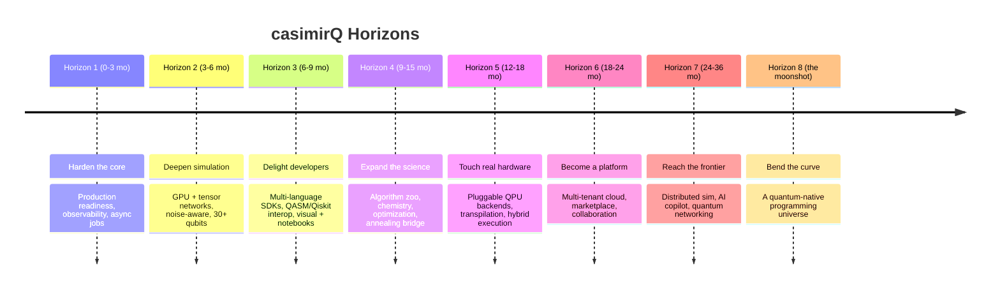
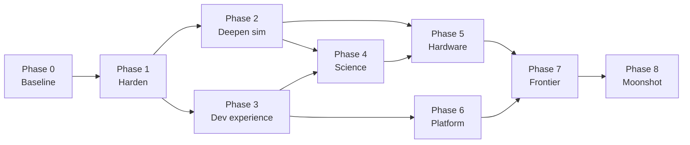

# casimirQ — The Grand Roadmap

> From a working quantum simulation platform to a full quantum development
> universe. This document covers the whole ecosystem: the **casimirQ** platform,
> the **casq-sdk** Rust client, and the **casq-tutorial** learning course.
>
> _Last updated: 2026-07-18._

---

## North Star

**Make quantum computing feel like ordinary software engineering — buildable,
testable, deployable, and teachable — for every developer, on every backend,
from a laptop simulator to real quantum hardware.**

We win when a developer who has never touched physics can go from "hello, qubit"
to shipping a quantum-accelerated feature in an afternoon, with the same
confidence they'd have shipping a REST API.

## Guiding principles

1. **Honest engineering.** Real engines, real persistence, real tests. No mocked
   demos dressed up as products. (This is how the platform got here.)
2. **The gate model is the substrate, not the ceiling.** Everything composes:
   circuits → algorithms → applications → hardware.
3. **Developer experience is the product.** The physics is a means; the ergonomics
   are the moat.
4. **Verifiable at every layer.** If we can't drive it end-to-end and observe it,
   it isn't done.
5. **Teach as we build.** Every capability ships with a lesson.

---

## Where we are today (the baseline)

A candid inventory of what already exists and works, verified end-to-end.

| Layer | Status | Notes |
| --- | --- | --- |
| Simulation engines | ✅ | Statevector, MPS, Clifford (stabilizer), auto-selection |
| Core algorithms | ✅ | QFT, Grover, Shor, VQE, QAOA, teleportation |
| Advanced features | ✅ | QEC (Steane/Shor), noise channels/models, quantum ML (kernels, VQE) |
| Persistence | ✅ | PostgreSQL, per-user, node-pg-migrate migrations |
| Auth | ✅ | JWT (signature-verified) + bcrypt + signup |
| API | ✅ | REST under `/api/v1`, guarded, validated |
| Frontend | ✅ | React + Vite circuit builder, simulations, algorithms |
| Ops | ✅ | GitHub Actions CI, Docker/compose, nginx single-origin |
| Rust SDK | ✅ | `casq-sdk` v0.2.0 — circuits, simulation, algorithms, advanced |
| Tutorial | ✅ | `casq-tutorial` — 19 lessons, novice → expert |

**Known ceiling today:** synchronous, single-node simulation (~16–24 qubits
depending on engine); gate model only (no annealing); simulators only (no real
hardware); one SDK language; single-tenant deployment.

The rest of this document is about systematically removing each ceiling — and
then building things nobody expects.

---

## The arc at a glance

---

## Phase 0 — Baseline lock-in (continuous)

**Goal:** never regress. Everything below assumes the current system stays green.

- Keep CI green across all three repos; add the SDK + tutorial to CI matrices.
- Contract tests between SDK and platform (the SDK's integration suite already
  pins the exact API JSON — extend it to every endpoint).
- A single `ecosystem` meta-repo or workspace README linking platform + SDK +
  tutorial with one-command bring-up.

**Exit criteria:** `docker compose up` + `cargo test` + frontend tests, all
green, from a clean checkout, documented in one place.

---

## Phase 1 — Harden the core (Horizon 1, 0–3 months)

**Theme:** make it production-grade before making it bigger.

### Workstreams

- **Asynchronous job execution.** Move long simulations off the request thread
  into a real job queue (BullMQ/Redis or Postgres-backed), with status polling,
  cancellation, and WebSocket progress (the gateways already exist). Frees the
  API from the synchronous `MAX_QUBITS` timeout ceiling.
- **Observability.** Structured logging, OpenTelemetry traces, Prometheus
  metrics (per-engine latency, queue depth, qubit histograms), health/readiness
  probes, and a Grafana dashboard.
- **Security pass.** Refresh-token rotation, secret management (no dev-fallback
  `JWT_SECRET` in prod), rate-limit tuning, RBAC (user/admin/service),
  dependency and container scanning in CI, an authenticated audit log.
- **Resilience.** Graceful shutdown, request timeouts, circuit-size guards with
  clear errors, idempotency keys for job submission, DB connection pooling limits.
- **Performance baseline.** Benchmark harness that tracks engine throughput per
  qubit count over time (catch regressions like the Clifford misrouting early).

### Deliverables
Async job API · metrics dashboard · security hardening checklist complete ·
load-test report · perf regression gate in CI.

**Exit criteria:** a 22-qubit statevector job runs async without blocking the
API, is observable end-to-end, and survives a pod restart.

---

## Phase 2 — Deepen the simulation (Horizon 2, 3–6 months)

**Theme:** break the qubit ceiling and add physical realism.

### Workstreams

- **GPU statevector engine.** Offload dense simulation to CUDA/Metal (or
  `wgpu`), pushing exact simulation from ~24 to ~30+ qubits.
- **Tensor-network engine.** A proper contraction-based backend for low-entangle-
  ment circuits (beyond the current MPS), with automatic bond-dimension control.
- **Noise-aware simulation.** Promote the noise *models* (Phase 0 today) into a
  full **density-matrix / Kraus-channel simulator** and a **stochastic
  trajectory** sampler, so users can run circuits *with* T1/T2 and gate errors,
  not just describe them.
- **Automatic engine routing v2.** A cost model that picks statevector vs.
  Clifford vs. tensor-network vs. density-matrix from circuit structure,
  entanglement estimate, and requested fidelity — with an override always
  available.
- **Deterministic seeds & reproducibility.** First-class seeding across all
  engines so results are reproducible for testing and grading.

### Deliverables
GPU engine · tensor-network engine · density-matrix noise simulator · engine
cost-model router · reproducibility guarantees + tests.

**Exit criteria:** a 30-qubit low-entanglement circuit and a noisy 10-qubit
density-matrix circuit both run and are validated against known results.

---

## Phase 3 — Delight developers (Horizon 3, 6–9 months)

**Theme:** meet every developer where they already are.

### Workstreams

- **OpenAPI/Swagger** spec generated from the controllers, published and
  versioned — the single source of truth for all clients.
- **Polyglot SDKs.** Generate/curate clients in **Python** (the lingua franca of
  quantum), **TypeScript**, and **Go**, all conformance-tested against the same
  contract suite the Rust SDK uses. Rust stays the reference implementation.
- **Interoperability.** Import/export **OpenQASM 3**; a **Qiskit/Cirq bridge** so
  existing circuits run on casimirQ unchanged. This is the on-ramp that unlocks
  the whole existing quantum community.
- **Notebooks.** First-class Jupyter/Python experience with inline circuit
  drawings and result plots; a `casq` CLI for scripting.
- **Visual upgrades.** Drag-and-drop circuit builder parity with the API,
  live Bloch-sphere and statevector visualizations, shareable circuit links.
- **Tutorial → interactive.** Port `casq-tutorial` into a browser playground
  (WASM-compiled SDK) where lessons run without a local toolchain.

### Deliverables
OpenAPI spec · Python + TS + Go SDKs · QASM3 import/export · Qiskit bridge ·
Jupyter kernel · interactive tutorial site.

**Exit criteria:** a Qiskit user runs their existing Bell circuit on casimirQ
via the Python SDK in under five minutes, from the docs alone.

---

## Phase 4 — Expand the science (Horizon 4, 9–15 months)

**Theme:** from a handful of algorithms to a living library.

### Workstreams

- **Algorithm zoo.** Deutsch–Jozsa, Bernstein–Vazirani, Simon's, Quantum Phase
  Estimation, HHL (linear systems), amplitude estimation, quantum walks,
  Grover variants (multi-target, partial), quantum counting — each with tests
  and a tutorial lesson.
- **Chemistry toolkit.** Molecular Hamiltonian builders, richer ansatze (UCCSD),
  active-space reduction, and a small molecule library so VQE is *usable*, not
  just demonstrable.
- **Optimization toolkit.** QUBO/Ising modeling, constraint encodings, and a
  **classical-annealing bridge** — accept QUBO problems (the D-Wave-style
  workflow the book covers) and solve them via QAOA *or* simulated annealing,
  unifying gate-model and annealing paradigms behind one API.
- **Error correction, for real.** Move QEC from "encode + syndrome" to full
  **decode + correct** cycles, logical gates, and a surface-code sandbox.
- **Quantum ML expansion.** Variational classifiers (VQC), quantum kernels at
  scale, and data-reuploading models, with a scikit-learn-style API.

### Deliverables
10+ new algorithms · chemistry module · QUBO/annealing bridge · full QEC
decode cycle · QML model library.

**Exit criteria:** a user solves a small MaxCut *and* a QUBO scheduling problem
through one consistent optimization API, and factors, decodes, and corrects a
logical qubit through a full QEC round.

---

## Phase 5 — Touch real hardware (Horizon 5, 12–18 months)

**Theme:** the same code, now on real qubits.

### Workstreams

- **Pluggable backend abstraction.** A `Backend` interface so simulators and real
  QPUs (IBM, IonQ, Rigetti, AWS Braket, Azure Quantum) are interchangeable behind
  the existing API. Users choose a target; nothing else changes.
- **Transpilation & routing.** Gate decomposition to each device's native set,
  qubit mapping/SWAP insertion for limited connectivity, and circuit optimization
  passes (the platform already has a `CircuitOptimizerService` to build on).
- **Hybrid execution.** Run the classical parts of VQE/QAOA on casimirQ while the
  quantum evaluations dispatch to real hardware — the realistic near-term pattern.
- **Error mitigation.** Zero-noise extrapolation, readout-error mitigation,
  probabilistic error cancellation — squeeze signal out of noisy devices.
- **Calibration-aware scheduling.** Pick the best available device/qubits from
  live calibration data.

### Deliverables
Backend plugin SDK · transpiler · ≥1 real-hardware integration · hybrid runtime ·
error-mitigation toolkit.

**Exit criteria:** an unchanged casq-sdk program runs a Bell state on a real QPU
by switching one `backend` parameter.

---

## Phase 6 — Become a platform (Horizon 6, 18–24 months)

**Theme:** from a service to an ecosystem others build on.

### Workstreams

- **Multi-tenant cloud.** Organizations, teams, projects, quotas, and usage-based
  metering/billing; SSO.
- **Collaboration.** Shareable circuits and results, versioned circuit history,
  comments, and reproducible "experiment" bundles.
- **Marketplace.** A registry where the community publishes algorithms, ansatze,
  noise models, and datasets — installable like packages.
- **Managed runtime.** Scheduled and triggered quantum jobs, webhooks, and a
  results data lake for analytics.
- **Compliance & governance.** SOC2-style controls, data residency, and
  per-tenant audit.

### Deliverables
Multi-tenant control plane · billing · collaboration features · package
marketplace · managed job runtime.

**Exit criteria:** a third-party team ships and monetizes a quantum module on the
marketplace without our involvement.

---

## Phase 7 — Reach the frontier (Horizon 7, 24–36 months, out-of-the-box)

**Theme:** ideas most quantum platforms aren't attempting yet.

- **Distributed & federated simulation.** Shard a single huge statevector across
  a GPU cluster (Phase 2 engine × N nodes), pushing exact simulation past 40
  qubits — a simulation supercomputer behind one API call.
- **AI quantum copilot.** An LLM-powered assistant that turns natural-language
  intent into circuits, explains results, spots the Clifford-vs-universal engine
  choice, and *proves* circuit equivalences. "Describe the state you want; get a
  verified circuit." (The `casq-sdk` typed surface is the perfect tool interface
  for an agent.)
- **ML-driven circuit compilation.** Reinforcement-learning transpiler that
  learns better gate decompositions and qubit routings than hand-written passes.
- **Quantum networking simulator.** Multi-node entanglement distribution,
  repeaters, and full **QKD network** simulation — generalizing Lesson 19's BB84
  into a whole quantum internet sandbox.
- **Differentiable quantum programming.** End-to-end gradients through circuits
  so quantum layers drop into PyTorch/JAX models like any other layer.
- **Continuous verification.** Every published circuit carries machine-checkable
  claims (this *is* a Bell state; this oracle *is* balanced) verified in CI —
  "formal methods for quantum programs."
- **Education at planetary scale.** The interactive tutorial becomes an adaptive,
  self-paced curriculum with auto-graded quantum "katas."

**Exit criteria:** a developer describes a problem in English and receives a
verified, hardware-ready, differentiable quantum program — simulated on a
40+ qubit distributed backend.

---

## Phase 8 — The moonshot: a quantum-native universe

**Theme:** the grand vision that reframes what the platform *is*.

Today, quantum programs are circuits we hand-assemble. The moonshot is to make
quantum a **first-class computational medium** the way GPUs became for graphics
and then for AI:

- **`casq` as a language, not just a library.** A small quantum-native DSL that
  compiles to any backend, with a type system that tracks entanglement, gate
  sets, and resource costs — catching "this won't fit on that device" at compile
  time.
- **Quantum-classical co-processing as the default.** Programs freely interleave
  classical and quantum computation; the runtime decides where each part runs
  (CPU, GPU, QPU) — the way a modern app doesn't think about which core runs what.
- **A self-improving optimizer.** The platform learns, across every job everyone
  runs, which engines, transpilations, and mitigations work best — and gets
  faster for everyone over time.
- **Open science flywheel.** Reproducible experiments, a shared results lake, and
  a marketplace turn casimirQ into infrastructure the quantum community builds
  *on top of* — the "GitHub + npm + Colab" of quantum.

**The turn-and-look moment:** a student, a researcher, and a startup engineer all
use the *same* casimirQ program — one to learn, one to publish a result, one to
ship a product — across simulators and real hardware, without rewriting a line.
When that happens, quantum computing has crossed from "specialist craft" to
"developer platform." That's the universe turning back to look.

---

## Cross-cutting tracks (every phase)

- **Testing:** unit + contract + integration + end-to-end browser/hardware, with
  a perf-regression gate. The existing SDK/tutorial verification discipline is
  the template.
- **Docs & DX:** every feature ships with API docs, an SDK example, and a
  tutorial lesson — the "teach as we build" principle.
- **Security & compliance:** threat-model each new surface; scan deps/containers;
  rotate secrets.
- **Community:** changelog, RFC process for big changes, contributor guide,
  public roadmap.

## How we measure success (KPIs)

| Dimension | Signal |
| --- | --- |
| Capability | Max qubits (exact / noisy / distributed); # algorithms; # backends |
| Adoption | SDK downloads across languages; active projects; marketplace modules |
| Reliability | CI green rate; p99 job latency; uptime; MTTR |
| Learning | Tutorial completions; time-to-first-successful-run |
| Fidelity | Simulator-vs-hardware agreement; error-mitigation gains |

## Risk register (top risks & mitigations)

| Risk | Mitigation |
| --- | --- |
| Scope sprawl | Phase gates with hard exit criteria; nothing starts before its dependency ships |
| Simulation scaling walls | Invest early in GPU + tensor-network + distributed (Phases 2, 7) |
| Hardware vendor churn | Backend abstraction isolates vendor APIs (Phase 5) |
| Correctness regressions | Contract tests + perf gate + continuous verification (Phases 0, 7) |
| DX fragmentation across SDKs | One OpenAPI contract; shared conformance suite (Phase 3) |
| Security surface growth | Threat-model per phase; automated scanning; least privilege |

## Sequencing & dependencies (the critical path)

Async jobs (Phase 1) and the engine work (Phase 2) unblock almost everything.
The OpenAPI contract (Phase 3) unblocks every future client. Ship those first.

---

## The first five things to do on Monday

1. **Async job queue** for simulations (Phase 1) — the single highest-leverage
   unblock.
2. **OpenAPI spec** generated from the controllers (Phase 3) — the contract every
   future SDK depends on.
3. **Density-matrix noise simulator** (Phase 2) — turns the noise *models* we
   already have into runnable physics.
4. **Python SDK** generated from the contract (Phase 3) — meet the community where
   it lives.
5. **Perf-regression benchmark gate** in CI (Phase 0/1) — protect everything above.

---

_This roadmap is a living document. Phases are sequenced by dependency, not
locked to dates; horizons are directional. Build honestly, verify everything,
teach as we go — and keep removing ceilings until quantum programming feels
ordinary._
